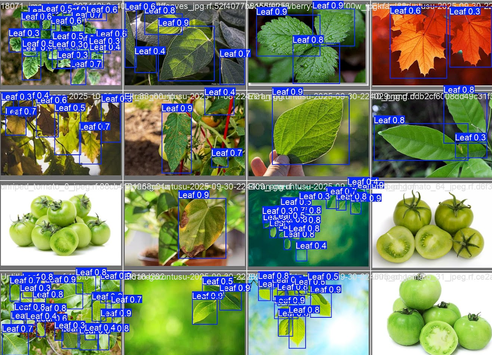
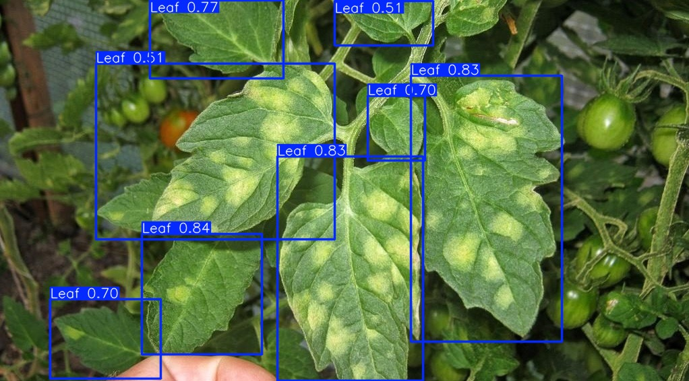

cat << 'EOF' > README.md
# 🍃 AI-Powered Autonomous Leaf Detection System (Phase 1)

## 🚀 Project Overview
This project represents the **computer vision module (Phase 1)** of an autonomous agricultural robot designed for plant disease monitoring. Utilizing a **YOLO-based object detection architecture**, this model detects plant leaves in complex greenhouse environments with high precision.

It is specifically engineered to overcome common agricultural challenges such as **occlusion** (overlapping leaves), **variable lighting** (backlight/shadows), and **visual similarities** (distinguishing green tomatoes from green leaves).

> **Current Status:** ✅ Phase 1 Completed (Detection) | 🔄 Phase 2 (Disease Classification) In Progress

---

## 🏆 Key Performance Metrics
The model was trained for **120 epochs** on approximately **10,000 labeled instances** at **1024px input resolution (imgsz=1024)**.

| Metric | Score | Significance |
| :--- | :---: | :--- |
| **mAP@50** | **0.83** | High detection accuracy |
| **Precision** | **0.83** | Low false positive rate |
| **F1-Score** | **0.76** | Optimal precision–recall balance |

---

## 🖼️ Real-World Inference Tests

### 1. Green Tomato Confusion Test 🍅

### 2. Texture & Disease Robustness 🍂

---

## 🛠️ Installation & Usage

1. **Clone the repository**

        git clone https://github.com/UmutUsenmez/Autonomous-Plant-Disease-Robot.git
        cd Autonomous-Plant-Disease-Robot

2. **Install dependencies**

        pip install -r requirements.txt

3. **Run inference**

        python src/inference.py path/to/your/image.jpg

---

## 🗺️ Roadmap
- [x] Phase 1: Robust Leaf Detection — Completed
- [ ] Phase 2: Disease Classification
- [ ] Phase 3: AI-Driven Treatment Recommendation and Reporting
---

## 👨‍💻 Author
**Umut**  
Mechatronics Engineering Student at **Yıldız Technical University**  
Focus: **AI · Computer Vision · Robotics**
EOF

